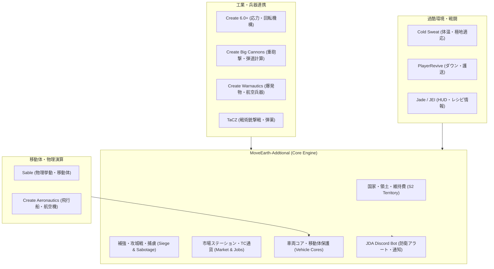

<div align="center">


# MoveEarth-Addtional

**工業の鼓動、砲煙たなびく戦場、そして台頭する国家。**

Createの機構美 × CBCの重砲撃 × TaCZの銃撃戦 を統合する、<br>本格国家運営・領土攻城戦・工業物流プラットフォーム

[](LICENSE)


[](https://discord.gg/QNquTTTdZh)

</div>

---

> [!NOTE]
> プロジェクト名およびMOD IDの `Addtional` という綴りは、既存環境およびセーブデータとの互換性維持のため意図して保持しています。

MoveEarth-Addtional は、Minecraft 1.21.1 (NeoForge) 上で稼働する大規模マルチプレイ国家戦略・工業戦争統合MODです。<br>
Create の歯車と動力機構、Create Big Cannons の重砲撃、TaCZ の戦術銃撃戦、Sable / Create Aeronautics の物理移動体を一つのゲーム進行へとシームレスに結びつけ、プレイヤー主導の国家運営とリアルタイム攻城戦を実現します。

現在の宣言バージョンは `3.1.0` です。最新の変更内容については [変更履歴](changelog.md) を参照してください。

---

## 主なシステム



### 🏛️ 国家・領土システム (Nation & Territory)
- **建国と組織運営**: プレイヤー自身による国家の創設、役職階層、権限設定、国民の招待・申請管理。
- **領土コアと密閉保護 (Enclosure Seal)**: 各領土に領土コアを設置。コアの全周囲を防壁ブロック等で完全に密閉・防護することで「密閉保護（無敵）」状態が維持されます。
- **24時間領土維持費**: 領土規模に応じた維持費が国庫から自動徴収されます。残高不足時は無防備化・放棄リスクが発生します。
- **外交と戦争**: 宣戦布告、停戦条約、無条件降伏、賠償金交渉など、国家間の外交関係を包括的に管理。
- **直感的な2ペインGUI**: `/s2` コマンドで呼び出せる統一デザイン（MoveEarthUi）のダッシュボードを搭載。

### ⚔️ 攻城戦・防壁補強・捕虜 (Siege, Reinforcement & Prisoner)
- **溶接機による段階的補強**: 専用の溶接機（Welding Tool）を使い、ブロックを木材から鉄、耐爆複合装甲へと段階的に強化。段階ごとに異なるHPと耐爆特性が付与されます。
- **リアルタイム攻城戦**: Create Big Cannons の大砲による直撃弾・榴弾や、Create Warnautics の航空爆発物に対する耐性・破壊計算。
- **コア破壊工作 (Sabotage) と陥落**: 防壁を破り敵コアへ侵入して工作を完了させることで、領土を制圧・陥落。
- **ダウン・捕虜護送・身代金**: 戦闘でダウンした敵兵を護送・収監。国家間の保釈金（身代金）交渉や脱走阻止の駆け引きが発生。
- **主権復興クエスト (Recovery Dispatch)**: 敗北国が主権を取り戻すための復興ミッション群を実装。
- **交戦タイマー (Combat Tag)**: 戦闘中の安全地帯逃げ込みや切断を防止するボスコントロールバー付き交戦管理。

### 🚢 移動体・車両コア・兵器連携 (Vehicles & Weaponry)
- **車両コア (Vehicle Core)**: Sable や Create Aeronautics によって組み立てられた移動体（戦車、装甲車両、飛行船、水上艦）に車両コアを登録。領土外の荒野でも一定の防護と権限保護を付与。
- **移動体兵器の統合**: 移動体上に搭載した Create Big Cannons や工業機構の安定動作をサポート。

### 📈 リアル物流経済・市場ステーション・職業 (Market & Trade Credit)
- **独自台帳通貨 Trade Credit (TC)**: 外部通貨MODに依存しない、完全自律型のインゲーム経済基盤。
- **物理市場ステーション (Market Station)**: 各国家に物理的な市場ステーションを設置。注文自体は遠隔からでも可能ですが、商品の納品・代金の預託・現物の受け取りは「自国のステーション」で行うリアルな物流網を再現。
- **職業システム (Jobs)**: 採掘・農業・軍事などの職業活動によって経験値と TC を獲得し、国家経済へ還元。

### ❄️ 過酷環境・レイド・PvPアリーナ (Cold Sweat, Raids & PvP)
- **Cold Sweat 極地サバイバル**: 極寒・極熱環境の温度HUDと、防寒対策を案内するバニラ進捗。
- **物資集積所 (Warehouse) レイド**: 各地に点在するNPC守備隊の拠点を攻略し、高価値な工業資材を強奪するPvEコンテンツ。
- **飛行船レイド (Airship Raid)**: 突如上空に来襲する敵飛行船部隊との迎撃戦闘。
- **専用PvPアリーナ**: 領土戦とは独立した競技用アリーナ（`/pvp`）。ロードアウト選択、マップ投票、ELOレーティングシステムを完備。

### 🤖 Discord Bot・サーバー運用統合 (Discord & Operations)
- **JDA完全内蔵Bot**: 外部プラグイン不要で、国家チャンネルへの領土防衛アラート（開戦・コア被弾・陥落等）の配信、緊急メンション、アカウント連携、スラッシュコマンド（`/moveearth setup` 等）を完備。
- **サーバー開館スケジュール管理**: 戦争可能時間や開館時間を制御するスケジューラー（DCC）。
- **リアルタイム近接チャット**: 同一ディメンション内で距離減衰・所属国家プレフィックス付きのチャット配信。
- **Web Analytics & Anti-ESP**: プレイヤー行動分析と負荷・不正対策。

---

## 動作環境

| 項目 | バージョン |
|---|---|
| Minecraft | 1.21.1 |
| NeoForge | 21.1.238（依存定義: 21以上） |
| Java | 21 |
| MoveEarth-Addtional | 3.1.0 |

### 必須MOD

クライアントおよび専用サーバーの両方に、同一バージョンの MoveEarth-Addtional と以下の必須MODを導入してください。

| MOD | 推奨バージョン | 役割 |
|---|---|---|
| **Create** | 6.0.10以上 | 工業・回転力・機構基盤 |
| **TaCZ** | 1.1.8以上 | 銃火器・弾薬・戦術戦闘 |
| **Sable** | 2.0.3以上 | 物理挙動・移動体基盤 |
| **Create Aeronautics** | 1.3.0以上 | 航空機・飛行船建造 |

> [!TIP]
> - **通貨**: 国家金庫、維持費、取引所には MoveEarth 独自の **Trade Credit (TC)** 台帳を使用します。Lightman's Currency への依存は完全に撤去されており、不要です。
> - **チャット**: MoveEarth が距離減衰・国家表示付きの独自チャットを内包しているため、Localized Chat などの別MODは導入不要です。

### 任意連携MOD

| MOD | 追加される連携機能 |
|---|---|
| **Create Big Cannons** | 大砲の直撃・榴弾による装甲補強ブロックへの弾道ダメージ計算 |
| **Create Warnautics** | 航空爆弾・特殊爆発物と防壁補強のダメージ連携 |
| **PlayerRevive** | 戦闘不能時のダウン、救助、敵兵の護送・捕虜収監連携 |
| **Cold Sweat** (2.4以上) | 極寒・極熱環境アラートHUD、防寒対策のバニラ進捗 |
| **Jade** (15.1.0以上) | 補強ブロックの段階・現在HP・密閉状態のHUD表示 |
| **JEI** (19.21.1.248以上) | Warehouseレイド報酬および独自アイテムのレシピ閲覧 |
| **Farmer's Delight** (1.3.3以上) | 農業・調理行動のJobs経験値連携 |
| **Curios** (9.5.1以上) | 特殊装備スロットの連携 |

TaCZの一人称腕描画中は、Mekaスーツによる腕モデルの置換・ポーズ初期化を抑止します。
銃を構えている間の腕はプレイヤースキン表示となり、Mekaスーツの腕装甲は表示しません。
通常の手持ちアイテム・素手・三人称のMekaスーツ描画と、装備性能は変更しません。
描画コンテキストの単体テストとビルドは実施済みですが、ゲーム内の見た目は未検証です。

---

## 配布物と導入方法

### 配布JARの選び方

ビルドによって生成される2種類の成果物を使い分けてください。

| 成果物名 | 導入先 | 内容 |
|---|---|---|
| `moveearth_addtional-<version>-player.jar` | **プレイヤーの `mods/`** | クライアント用JAR。Discord Bot本体やサーバー専用地形データを除外した軽量構成。 |
| `moveearth_addtional-<version>-server.jar` | **専用サーバーの `mods/`** | サーバー用JAR。内蔵 Discord Bot ランタイム（JDA）や地形生成データを含む完全版。 |

- **同時更新**: クライアントとサーバーで必ず同一バージョンの JAR を使用してください。
- Discord RPC（クライアント側）および JDA（サーバー側）は MOD 内部に組み込まれているため、外部ライブラリを追加導入する必要はありません。

### 専用サーバーのセットアップ手順

1. Java 21 対応の Minecraft 1.21.1 / NeoForge 専用サーバー環境を構築します。
2. `moveearth_addtional-<version>-server.jar` および必須MODを `mods/` へ配置します。
3. 専用の地形タイルをワールドの `moveearth_terrain/` または `config/moveearth_terrain/` へ配置します。
4. サーバーを一度起動して設定ファイルを自動生成させ、必要に応じて編集後に再起動します。

> [!IMPORTANT]
> server JAR は起動時に MoveEarth 地形タイルを検証します。有効なタイルが存在しない場合は起動が中断されるため、事前に [地形ツールの手順](tools/terrain/README.md) を確認してください。既存ワールドへの途中導入は境界の乱れが生じるため、新規ワールドでの事前検証を推奨します。

---

## 主な設定ファイル

設定ファイルは初回起動時に `config/` ディレクトリへ自動生成されます。

| 設定ファイル名 | 主な管理対象 |
|---|---|
| `moveearth_addtional-s2-territory.toml` | 国家設立コスト、領土サイズ、防壁補強HP、維持費周期、Siegeルール |
| `moveearth_addtional-discord.toml` | Discord Bot トークン、チャンネルID連携、通知設定 |
| `moveearth_addtional-market.toml` | 市場ステーションの取引有効化・緊急停止設定 |
| `moveearth_addtional-chat.toml` | 近接チャットの配信半径ブロック数（既定値: 100） |
| `moveearth_addtional-dcc.toml` | サーバー開館・戦争可能スケジュール制御 |
| `moveearth_addtional-aeronautics.toml` | 移動体・Aeronautics 連携パラメータ |
| `moveearth_addtional-recovery-dispatch.toml` | 敗北国家の主権復興・派遣ミッション設定 |
| `moveearth_addtional-tpa.toml` | テレポート要請機能の制限とクールダウン |
| `moveearth_addtional-tips.toml` | 定期Tipsの配信間隔とメッセージ一覧 |

> Discord Bot のトークンは必ずサーバー側設定に記入し、Git コミットや公開 Issue に含めないでください。運用の詳細は [Discord Bot 運用ガイド](DISCORD_BOT_OPERATIONS.md) を参照してください。

---

## 開発環境

必要な環境はJava 21、Git、初回の依存取得が可能なGradle環境です。

```shell
git clone https://github.com/RuskServer/MoveEarth-Addtional.git
cd MoveEarth-Addtional
```

### 依存MOD・ライブラリ

依存MODとライブラリはすべてGradleがMavenリポジトリから取得します。手作業で`lib/`へJARを置く
必要はありません（旧手順の`lib/`はビルドから参照されなくなりました）。

| 取得元 | 対象 |
| --- | --- |
| Modrinth Maven | Create、TaCZ（1.21.1 NeoForge移植版）、PlayerRevive、Farmer's Delight、Create Aeronautics、Jade、Create: Rock & Stone、Create: Diesel Generators |
| CreateMod Maven | Ponder、Flywheel |
| FirstDark Maven | `discord-rpc` |
| その他 | Sable、JEI、Cold Sweat、Curios、JDA、SQLite JDBC |

各バージョンは`build.gradle`で固定しています。`discord-rpc`はクライアント機能のためにMod本体へ
クラスを統合するライブラリであり、単体の導入MODではありません。依存JARをコミットしたり
Pull Requestへ添付したりしないでください。

### ビルドとテスト

標準的なビルドには同梱の Gradle Wrapper（Linux/macOS: `./gradlew`、Windows: `gradlew.bat`）を使用します。

```shell
# 単体テストの実行
./gradlew test

# 全体アセンブル
./gradlew assemble
```

個別の成果物だけを作る場合は次を使用します。

```shell
./gradlew buildPlayerJar
./gradlew buildServerJar
```

成果物は `build/libs/` 配下に生成されます。自動テストには国家・領土、補強、Jade、UI、地形生成、サーバー機能などの単体テストが含まれます。

> [!TIP]
> リポジトリローカルの JDK / Gradle キャッシュ（`.local-tools/`）が構成されている開発環境では、オフライン実行に対応した `tools/gradle-local.sh`（例: `tools/gradle-local.sh assemble --offline`）も利用できます。

> [!NOTE]
> code-server が `127.0.0.1:8080` を使用している環境では、`AnalyticsWebServerTest` がテスト用HTTPサーバーを開始できず、環境由来で失敗する場合があります。既存サービスを停止せず、ポート占有を確認したうえで、対象テストと `assemble` を別途検証してください。

---

## ドキュメントポータル

詳細な設計書および運用ガイドは、以下のドキュメントを参照してください。

- **運用・ゲームプレイガイド**:
  - [Discord Bot 運用・設定ガイド](DISCORD_BOT_OPERATIONS.md)
  - [攻城戦・防壁補強プレイガイド](siege_gameplay_guide.md)
  - [市場・物流システム検証](market_logistics_verification.md)
  - [地形生成ツール・タイル配置手順](tools/terrain/README.md)
- **設計書・仕様詳細**:
  - [S2 国家・領土・攻城戦計画書](s2_system_plan.md)
  - [経済システム再構築計画](economy_rebuild_plan.md)
  - [地形生成計画書](terrain_generation_plan.md)
  - [地方別資源計画書](resource_region_plan.md)
  - [変更履歴 (Changelog)](changelog.md)
  - [アーカイブ・過去計画書](archive/plans/README.md)

---

## コントリビューション・ライセンス

### 貢献方針
1. このリポジトリを Fork して作業ブランチを作成します。
2. 変更範囲に対応するテストと `./gradlew assemble`（ローカルツール環境の場合は `tools/gradle-local.sh assemble --offline`）を通過させます。
3. `git diff --check` を確認し、不要な一時ファイルや秘密情報が含まれていないことを確認します。
4. ゲーム進行や権限判定は必ずサーバーオーソリテーティブ（Server-Authoritative）で実装してください。
5. プレイヤー向けUI・チャット表示を追加する場合は、日本語と英語の両方のリソースを用意してください。

### ライセンス

MoveEarth-Addtional のオリジナルコードおよび素材は [GNU General Public License version 3 only (GPL-3.0-only)](LICENSE) の下で提供されています。

一部のコンポーネント、ライブラリ、音声、画像素材には個別のライセンスが適用されます。詳細は [第三者ライセンスと帰属表示](THIRD_PARTY_NOTICES.md) および [LICENSES/](LICENSES/) を参照してください。
